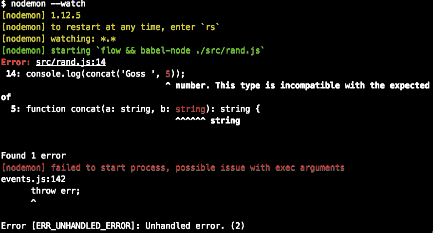

В этой ветке используется минимальная конфигурация ESLint - без красивостей типа const obg = { key: 'prop' };

Но зато подключена проверка Flow - для этого используются babel-preset-flow и соотв. настройка в .babelrc

и

```
{
  "extends": [
   "rallycoding",
   "plugin:flowtype/recommended"
  ],
  "plugins": [
    "flowtype"
  ],
  "rules": {
    "no-alert": 0,
  }
}

```

И в package.json у нас `start: "nodemon --watch"`

и соотв.

```
{
  "execMap": {
    "js": "flow && babel-node"
  }
}
```
в файле nodemon.json

Как пример в ./src/rand.js содержится ошибка: функции, у которой оба аргумента аннотированы как string один из аргументов передаётся как number, возникает следующая ошибка:



Исправьте и перезапустите yarn start
